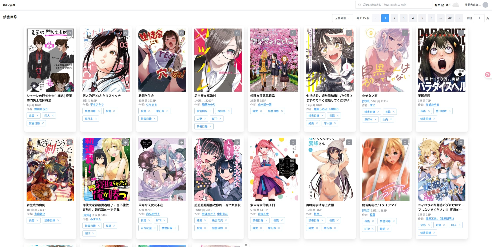
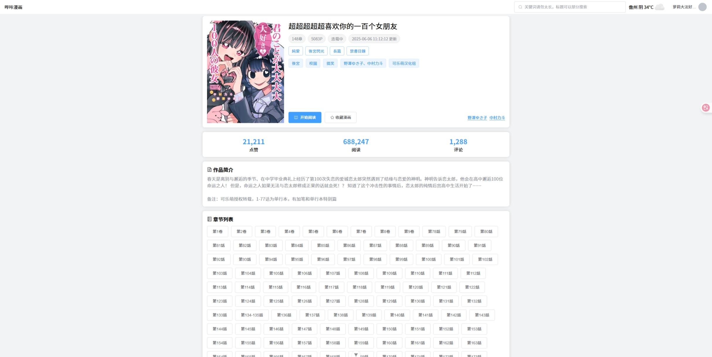
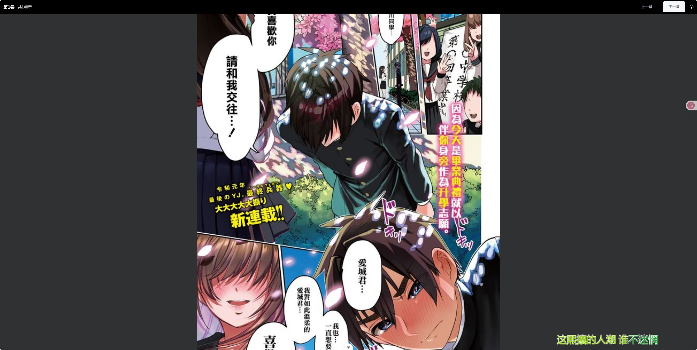

# pic-age

哔咔漫画的PC版本，因使用了 `vercel` 进行打包构建，目前需要翻墙使用

测试地址: [https://bika-acg.vercel.app/#/](https://bika-acg.vercel.app/#/)

### 使用说明

- 图片默认为隐藏状态，通过用户头像-设置-漫画阅读设置，把隐私模式关掉即可正常使用

### 对比哔咔的网页版，有什么区别

- 访问漫画列表、详情、使用新开标签页，防止丢失当前信息
- 增加关注作者、稍后再看功能
- 自动阅读功能，希望能帮你解放右手
- 等等...

### 预览

### 待开发/TODO

- ui美化

### 建议

- 希望大家多多提意见
